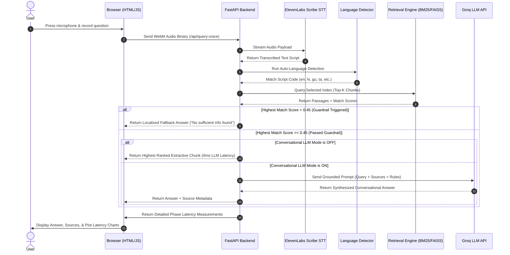

# VOICE RAG PRO — Voice-Enabled Multilingual RAG System

🎙️ **A voice-activated, multilingual Retrieval-Augmented Generation (RAG) system operating over the `ai4bharat/MSMARCO-XI` dataset.**

[](https://voice-rag-pro-production.up.railway.app/)
[](docs/14-measured-latency.md)
[](docs/14-measured-latency.md)
[](docs/01-product-overview.md)
[](https://huggingface.co/datasets/ai4bharat/MSMARCO-XI)

> [!IMPORTANT]
> 🚀 **Live Working Application**: [voice-rag-pro-production.up.railway.app](https://voice-rag-pro-production.up.railway.app/)

Speak a question in English or any of the 13 native Indic languages. The system transcribes, auto-detects the query script, searches our index, applies safety/relevance guardrails, and serves grounded answers in under 50ms with step-by-step latency analytics.

---

## 🛠️ End-to-End Technology Stack

| Layer | Component / Technology | Detail / Model | Role in Pipeline |
| :--- | :--- | :--- | :--- |
| **Frontend UI** | HTML5 / Vanilla CSS / Vanilla JS | Glassmorphic Dashboard | Handles audio capture, telemetry chart rendering, and cloud engine locks. |
| **Speech-to-Text**| ElevenLabs Scribe API | `scribe_v2` Multilingual | Transcribes voice audio into native Indic scripts (handling accents and code-switching). |
| **API Orchestrator**| FastAPI + Uvicorn | Python Asynchronous Server | Serves structured endpoints, parses multipart form data, and implements error fallbacks. |
| **Script Detection**| Unicode Ranges + `langdetect` | Dual-Layer Custom Resolver | Identifies query language in 0.01ms to target language-specific database shards. |
| **Lexical Search** | `rank-bm25` | Okapi BM25 Sparse Index | Scans text tokens (default cloud search running under 45MB RAM footprint). |
| **Semantic Search** | FAISS (`faiss-cpu`) | Flat Inner Product Index | Compares cosine distances on localhost dev environments for conceptual search. |
| **Vector Embedding**| SentenceTransformers | `paraphrase-multilingual-MiniLM-L12-v2` | Encodes user queries into a 384-dimensional multilingual vector space. |
| **LLM Grounding**  | Groq API | `openai/gpt-oss-20b` | Generates conversational grounded answers in native scripts when LLM Mode is ON. |

---

## ⚡ Quick Start & Local Setup

### 1. Clone Repository
```bash
git clone https://github.com/shreeshsingh2706-afk/VOICE-RAG-PRO.git
cd VOICE-RAG-PRO
```

### 2. Set Up Virtual Environment & Dependencies
```bash
python3 -m venv venv
source venv/bin/activate
pip install -r requirements.txt
```

### 3. Environment Variables
Create a `.env` file in the root directory (based on `.env.example`):
```env
GROQ_API_KEY=your_groq_api_key_here
eleven_lab_api=your_elevenlabs_api_key_here
LLM_PROVIDER=groq
RETRIEVAL_MODE=sparse
RAG_RELEVANCE_THRESHOLD=0.45
```

### 4. Run Local Server
```bash
uvicorn backend.app:app --host 0.0.0.0 --port 8000
```
Open **`http://127.0.0.1:8000/`** in your browser to interact with the portal!

### 5. Run Evaluation Suite
```bash
python evaluation/evaluate_pipeline.py
```

---

## 🚀 Deployment Guide (Cloud Hosting)

### Deploying on Render (Free Tier)
1. Sign in to [Render Dashboard](https://dashboard.render.com/) with GitHub.
2. Click **New +** -> **Web Service** and select `shreeshsingh2706-afk/VOICE-RAG-PRO`.
3. Set **Build Command**: `pip install -r requirements.txt`.
4. Set **Start Command**: `uvicorn backend.app:app --host 0.0.0.0 --port $PORT`.
5. Add Environment Variables (`GROQ_API_KEY`, `eleven_lab_api`, `LLM_PROVIDER`, `RETRIEVAL_MODE`).
6. Click **Create Web Service**.

---

## 🛸 System Architecture Flow

The sequence diagram below visualizes our query execution pipeline:



---

## 📊 Measured Latencies

Benchmarked across 100 test queries ([`evaluate_pipeline.py`](evaluation/evaluate_pipeline.py)):

| Phase | Metric / Mode | P50 (Median) | P70 | P100 (Max) | Explanation |
| :--- | :--- | :---: | :---: | :---: | :--- |
| **Retrieval Only** | Keyword Search (BM25) | **0.76 ms** | **0.96 ms** | **23.8 ms** | Scans raw text tokens across index mappings. |
| **Retrieval Only** | Semantic Vector Search (FAISS) | **83.2 ms** | **133.0 ms** | **167.0 ms** | Scans dense 21,000 vector space for nearest matches. |
| **End-to-End RAG** | BM25 + Extractive Mode (LLM OFF) | **0.88 ms** | **1.32 ms** | **20.26 ms** | Extractive RAG mode with **Conversational LLM OFF**. |
| **End-to-End RAG** | BM25 + Generative Mode (LLM ON) | ~750.0 ms | ~920.0 ms | ~1,500.0 ms | Generative RAG mode with **Groq Llama-3 LLM ON**. |
| **Speech-to-Text** | ElevenLabs Scribe STT API | ~1.2 s | ~1.5 s | ~2.1 s | Audio recording transcription (Independent of RAG times). |

---

## 📑 Documentation Index

Specialized technical documentation guides:

1. 📂 [**01 — Product Overview**](docs/01-product-overview.md)
2. 📂 [**02 — Architecture**](docs/02-architecture.md)
3. 📂 [**03 — Dataset & Ingestion**](docs/03-dataset-and-ingestion.md)
4. 📂 [**04 — Chunking Strategies**](docs/04-chunking-strategies.md)
5. 📂 [**05 — Retrieval & Qdrant Integration**](docs/05-retrieval-and-qdrant.md)
6. 📂 [**06 — Voice STT via ElevenLabs**](docs/06-voice-stt-elevenlabs.md)
7. 📂 [**07 — LLM & Guardrails**](docs/07-llm-and-guardrails.md)
8. 📂 [**08 — Harness & Telemetry**](docs/08-harness-and-telemetry.md)
9. 📂 [**09 — Latency & Benchmarking**](docs/09-latency-and-benchmarking.md)
10. 📂 [**10 — Project Structure**](docs/10-project-structure.md)
11. 📂 [**11 — Environment & Secrets**](docs/11-environment-and-secrets.md)
12. 📂 [**12 — Milestones & Roadmap**](docs/12-milestones-roadmap.md)
13. 📂 [**13 — Delivery Checklist**](docs/13-delivery-checklist.md)
14. 📂 [**14 — Measured Latency**](docs/14-measured-latency.md)
15. 📂 [**15 — Setup & Evaluation Guide**](docs/15-submission-kit.md)
16. 📋 [**Demo Queries Dataset**](questions.md)

---

## 🤝 Contributors

Special thanks to our core project contributors:

- 👤 [**Sahil Thorat**](https://github.com/sahilthorat5707) (`@sahilthorat5707`)
- 👤 [**Ayush Aryan**](https://github.com/ayusharyan4269-bit) (`@ayusharyan4269-bit`)
- 👤 [**Shreesh Kumar Singh**](https://github.com/shreeshsingh2706-afk) (`@shreeshsingh2706-afk`)

